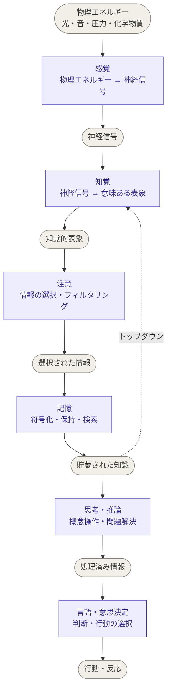

認知心理学とは、人間が刺激を受けてから意思決定を行うまでを体系的に記述する学問である。
## 意思決定プロセス
心は以下のような手順で情報処理する。
1. 感覚
2. [[20260320010738-perception|知覚]]
3. [[20260320101704-attention|注意]]
4. 記憶
5. 思考・推論
6. 言語・意思決定

---
## Ref
2026/03/19
- Claude との会話