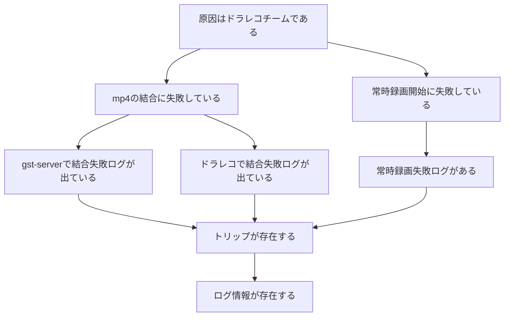

## 前提

| 記号                                    | 名前   | 説明                                                          |
| ------------------------------------- | ---- | ----------------------------------------------------------- |
| $P^*$                                 | 命題集合 | あらゆる命題を内包する集合                                               |
| $L: P^*\times P^*\rightarrow 2^{P^*}$ | 探索写像 | 任意の命題$p, q\in P^*$について、$q\subseteq p$となるような全ての$p$の部分命題を出力する |


## 演繹推論
### 前提

| 記号                                                                                                                      | 名前    | 説明    |
| ----------------------------------------------------------------------------------------------------------------------- | ----- | ----- |
| $E^n:\left(2^{P^*}\right)^{n}\rightarrow 2^{P^*}$                                                                       | 評価写像  |       |
| $N^*= \left\{\left(p,S,e\right)\textbar p\in P^*, S\subset P^*, p\notin S, p\neq s, e\in E^{\left\| S\right\|}\right\}$ | ノード集合 |       |
| $D\in 2^{N^*}$                                                                                                          | 命題グラフ | 有向グラフ |
| $C\subseteq N^*$                                                                                                        | 結論ノード |       |
### 命題グラフの構築

### 推論手順
推論においては、$C$に属する各ノードについて、評価写像$e$の値を計算することを目的に、子孫の評価写像を芋づる式に計算する。
### 推論例
```
10:00 起動
10:01 常時録画開始
10:02 シャットダウン
11:00 起動
11:01 常時録画失敗
11:05 シャットダウン
12:00 起動
12:01 常時録画開始
12:02 mp4再生要求受付
12:02 gst-serverでmp4結合失敗
12:02 ドラレコでmp4結合失敗
12:05 シャットダウン
```

```mermaid
graph TD
    A[原因はドラレコチームである]
    B[mp4の結合に失敗している]
    C[常時録画開始に失敗している]
    D[gst-serverで結合失敗ログが出ている]
    E[ドラレコで結合失敗ログが出ている<br>()]
    F[常時録画失敗ログがある<br>(11:01)]
    G[トリップが存在する<br>(10:00~10:02, 11:00~11:05, 12:00~12:05)]
    H[ログ情報が存在する<br>(10:00~12:05)]
    A --> B
    A --> C
    B --> D
    B --> E
    C --> F
    D --> G
    E --> G
    F --> G
    G --> H
```