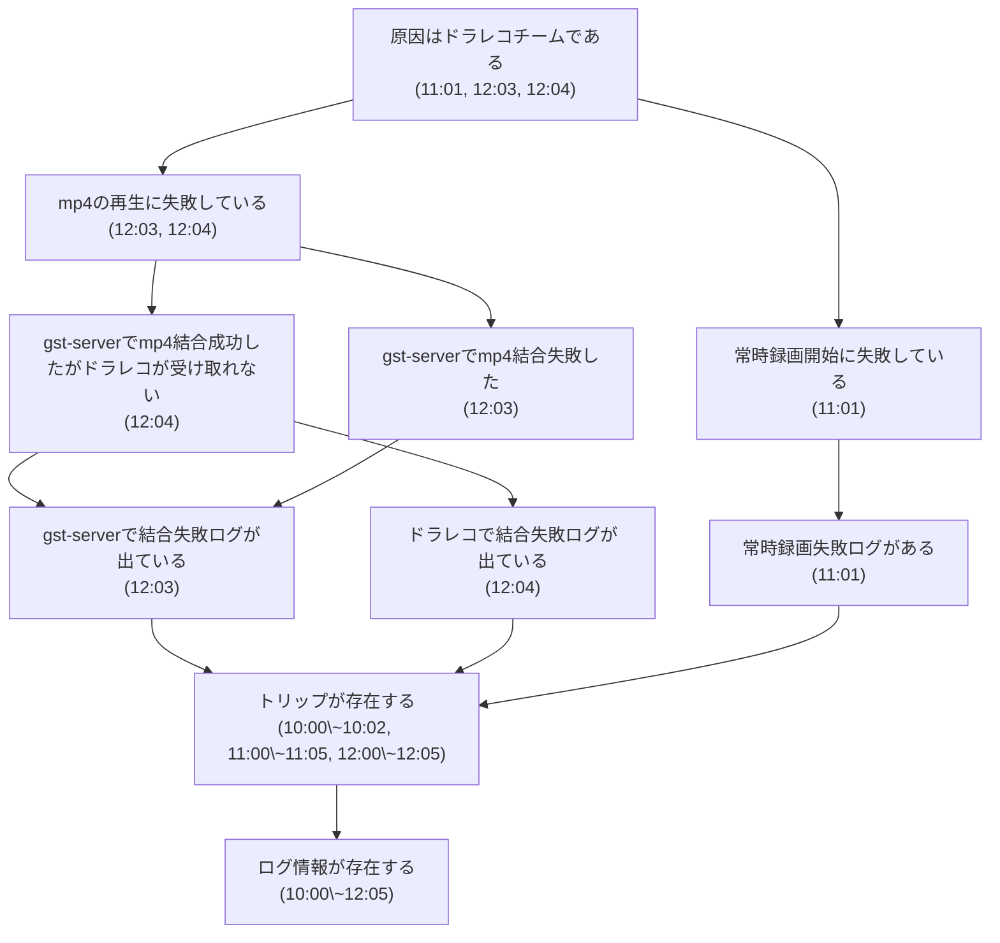

## 前提

| 記号                                    | 名前   | 説明                                                               |
| ------------------------------------- | ---- | ---------------------------------------------------------------- |
| $P^*$                                 | 命題集合 | あらゆる命題を内包する集合                                                    |
| $L: P^*\times P^*\rightarrow 2^{P^*}$ | 探索写像 | 任意の命題$p, q, r\in P^*$について、$r \implies q$となるような$p$の部分命題$r$を複数出力する |
|                                       |      |                                                                  |
## 演繹推論
### 前提

| 記号                                                                                                                      | 名前    | 説明    |
| ----------------------------------------------------------------------------------------------------------------------- | ----- | ----- |
| $E^n:\left(2^{P^*}\right)^{n}\rightarrow 2^{P^*}$                                                                       | 評価写像  |       |
| $N^*= \left\{\left(p,S,e\right)\textbar p\in P^*, S\subset P^*, p\notin S, p\neq s, e\in E^{\left\| S\right\|}\right\}$ | ノード集合 |       |
| $D\in 2^{N^*}$                                                                                                          | 命題グラフ | 有向グラフ |
| $C\subseteq N^*$                                                                                                        | 結論ノード |       |
### 推論手順
推論においては、$C$に属する各ノードについて、評価写像$e$の値を計算することを目的に、子孫の評価写像を芋づる式に計算する。
### 推論例
```
10:00 起動
10:01 常時録画開始
10:02 シャットダウン
11:00 起動
11:01 常時録画失敗
11:05 シャットダウン
12:00 起動
12:01 常時録画開始
12:02 mp4再生要求受付
12:03 gst-serverでmp4結合失敗
12:04 ドラレコでmp4結合失敗
12:05 シャットダウン
```

