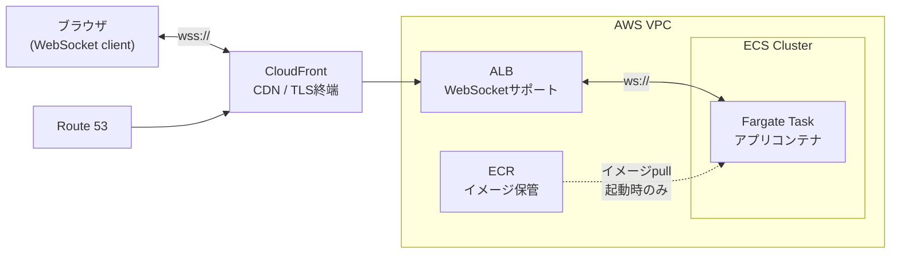

# FargateへWebSocketを繋げる

#opinion

[[2026060605]]上でwebsocketサーバーを稼働させる時の構成。

## 要件

- fargate task上で任意のwebsocketサーバーを動作させること
    - 1セッションの負荷は大きいため、1タスクが同時に処理できるセッション数には上限がある
    - セッションがある程度増減したら、タスクを自動で増減させる (オートスケール)
- ユーザーのブラウザからwebsocketサーバーにアクセスできること

## 構成図

## ポイント

- [[2026060614|ALB]]により、websocketセッション毎に、適切なfargateタスクにルーティング
    - Auto Scalingにより、振り分け先の[[2026060605|Fargate Task]]は増減する
